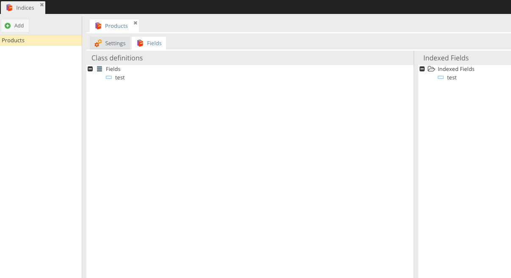

# Pimcore - Object Index

## Requirements
 - Pimcore 5

[](LICENSE.md)

ObjectIndex helps you create rich indices and query your Object-Data using re-usable and easy to configure Filters.

## Getting started
 * Since Object-Index depends on CoreShops IndexBundle, and the IndexBundle only exists in DEV yet, you need to set your "minimum-stability" to "dev" in your composer.json
 * Install via composer ```composer require dpfaffenbauer/object-index dev-master```
 * Load needed Bundles:
    ```php
    <?php

    // app/AppKernel.php
    public function registerBundlesToCollection(BundleCollection $collection)
    {
        $collection->addBundles(array(
            new \JMS\SerializerBundle\JMSSerializerBundle(),

            new \CoreShop\Bundle\ResourceBundle\CoreShopResourceBundle(),
            new \CoreShop\Bundle\IndexBundle\CoreShopIndexBundle(),

            new \FOS\RestBundle\FOSRestBundle(),
            new \Doctrine\Bundle\DoctrineCacheBundle\DoctrineCacheBundle(),
            new \Stof\DoctrineExtensionsBundle\StofDoctrineExtensionsBundle(),
        ), 120);
    }
    ```
 * Open Extension Manager in Pimcore and enable/install Plugin
 * It sometimes happens to me that assets are not getting installed right from pimcore, therefore run ```bin/console assets:install --symlink```
 * Install via Pimcore Extension Manager
 * After Installation within Pimcore Extension Manager, you have to reload Pimcore
 * You now have a new Menu Entry for Indexes and Filters

## Conflicts
This Bundle conflicts with coreshop/core-shop cause it uses the same database tables, API's and ExtJS UI as CoreShop does.
If you want to install CoreShop after installing ObjectIndex, remove ObjectIndex and Install CoreShop. You won't loose any data. CoreShop comes with the same bundle and
therefore uses the same UI and Tables!

## Usage

First, you need to create Index. To create a new index, you need to implement the interface "CoreShop\Component\Index\Model\Indexable".

You can read more about it [here](http://www.coreshop.org/docs/2.0.0/Bundles/IndexBundle.html)

## Screenshots


